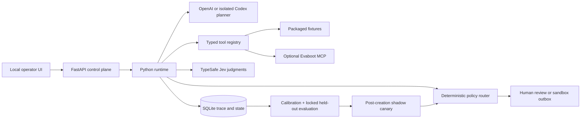

# Architecture

The runtime uses a bounded plan → act → observe → revise loop. Models propose typed values; Python owns every side effect and state transition.

## Control-plane boundaries

The model can create a plan, choose one currently permitted tool, draft source-cited claims, and propose one whitelisted policy change. It cannot grant itself tools, alter budgets, approve delivery, change labels or acceptance criteria, or promote policy.

`Runtime._allowed_tools` is the orchestration authority. It exposes only actions valid for the persisted state and withholds `done` while actionable leads remain. `ToolRegistry` validates typed arguments and sanitizes observations before they enter the trace.

Jev returns semantic probabilities. `policy.py` combines those estimates with deterministic evidence, email, suppression, duplicate, citation, staleness, and threshold checks. Missing services fail closed.

## Persistence and recovery

SQLite stores runs, events, leads, exports, feedback, policies, candidates, outcomes, suppressions, sandbox outbox rows, and candidate-scoped canary observations. Export starts, outcomes, deliveries, and canary observations have idempotency keys. The simulator deliberately exercises a retryable poll failure.

## Policy lifecycle

1. Calibration labels select threshold snapshots.
2. Baseline and candidate are evaluated on a separate held-out set.
3. Assisted candidates require explicit human approval.
4. Autonomous candidates enter `awaiting_canary`; historical outcomes never count.
5. New reply, bounce, and conversion events are scored under baseline and candidate policies in shadow mode.
6. Promotion occurs only after the candidate sample minimum and adverse-rate non-regression bound pass. Baseline drift or incomparable observations fail closed.

## Distribution

Policies, evaluation fixtures, and static UI assets live under `evaboot_agent.resources`, so editable installs and wheels use the same source of truth. Mutable state defaults to `.evaboot-agent/` in the operator's working directory.
